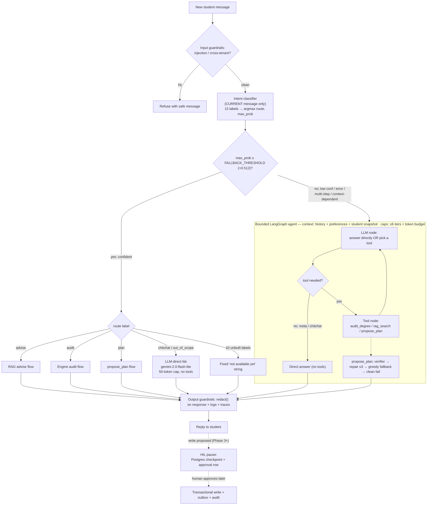

# Keel — DESIGN (agent runtime)

> This section documents how a student message flows through the system and how the
> agent's memory is split. Source of truth for contracts: `spec.md` §3.2 (router),
> §3.5 (agent), §3.6 (preferences).

## Message-routing paths

Key properties:
- The classifier sees the current message only. Context-dependent follow-ups score
  low confidence and fall to the agent, which has the conversation history.
- General/meta messages are answered cheaply by the lite LLM when confident, or by
  the agent (no tools) when not.
- A direct agent answer is allowed only for meta/chitchat; any academic question
  goes through a grounding tool.
- Writes never execute inline — they pause for human approval (Phase 3+).

## Agent memory model — three stores, by durability need

| Store | Backend | Holds | Lifetime |
|-------|---------|-------|----------|
| Session/chat memory | Redis (30-min sliding TTL) | last N turns | ephemeral; fine to lose when idle |
| Graph checkpointer | Postgres (`AsyncPostgresSaver`) | in-flight graph state | durable — survives restart + long HIL pause |
| Approval / pending write | Postgres (`request_queue` + audit + outbox) | the action a human approves | permanent, audited |

All three are constructed in `lifespan`, stored on `app.state`, and accessed via
`Depends` — never at import time. "What's in Postgres vs Redis": durable run-state
and approvals are Postgres; short-term chat context is Redis.

## Per-turn context envelope

Assembled deterministically and passed to the agent each turn:
current message · last N turns (bounded) · structured student preferences
(Postgres) · engine-computed student snapshot (program, standing, term, holds, GPA,
completed-credit summary) · active plan reference. Policy text is retrieved via
`rag_search` on demand, not injected. The whole envelope is redacted at every
egress, and a preference can never relax a deterministic constraint.

## Topology decision

One bounded agent behind the trained router — no multi-agent / supervisor. The
router is the deterministic supervisor; sub-agents would add orchestration, latency,
cost, and eval surface with no correctness gain (correctness lives in the engine).
Tools are namespaced (planning / advising / action) inside the single agent.
