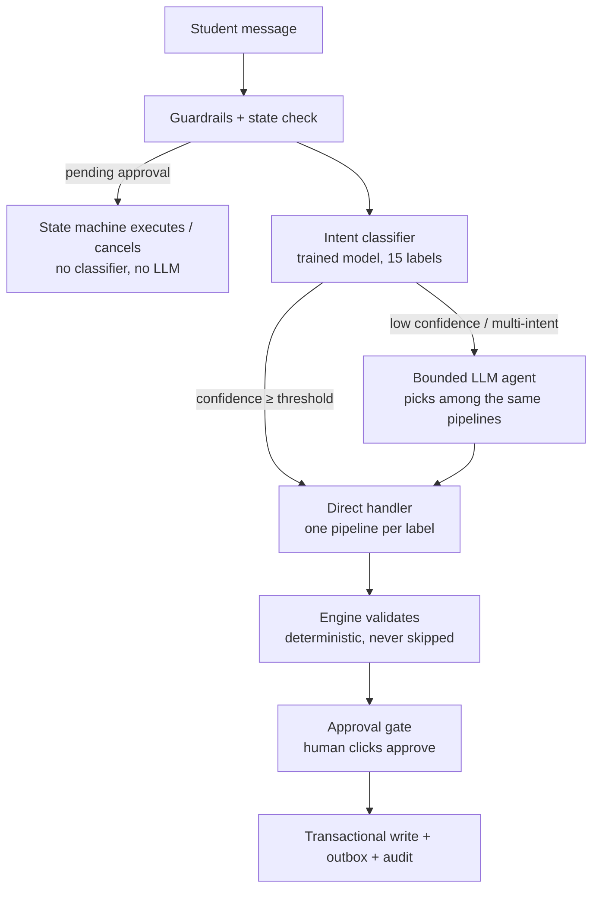

# Keel — Tools, Routing & Cheap Turns (Summary)

> Reflects the **final** agreed design (label → handler directly; agent as fallback),
> not the earlier "lane + LLM picks tool" draft.

## 1. The tools

Every feature in the brief (A1–G1) is a combination of these ~20 tools, grouped by risk.

### Group A — Read tools (lookups only; no risk, no approval)

| Tool | What it does |
|---|---|
| `audit_degree()` | Done / missing requirements, remaining credits |
| `get_prerequisites(course)` | Prereq chain from the DAG |
| `search_sections(courses, prefs)` | Open, conflict-free section combinations |
| `rag_search(question)` | Course/policy info from tenant documents |
| `predict_risk(plan)` | Risk model score + reasons |
| `estimate_gpa(plan)` | LLM guess, heavily caveated |
| `simulate_whatif(change)` | Re-audit under a change (new major, early grad) |
| `recommend_electives(prefs)` | Ranked eligible electives |
| `suggest_career_path(interest)` | Career → skills → catalog electives |
| `list_plans()` / `get_plan(id)` | Saved plans |
| `my_info(query)` | Student's own schedule / enrollments / grades — **pure DB query + template, no RAG, no LLM** |

### Group B — Propose tools (create a draft; nothing written)

| Tool | What it does |
|---|---|
| `propose_plan(constraints)` | The generate → verify → repair loop |
| `propose_swap(plan, old, new)` | Edited plan, re-verified |
| `draft_petition(course, reason)` | Petition text |

### Group C — Write tools (change real data; **always behind the approval gate**)

| Tool | What it writes |
|---|---|
| `save_plan` / `activate_plan` | Plan entity |
| `execute_enrollment(plan, sections)` | Enrollment rows |
| `waitlist_join(section)` / `waitlist_leave(section)` | Waitlist rows |
| `apply_graduation()` | Request-queue row |
| `request_major_change(program)` | Request-queue row |
| `submit_petition(draft)` | Request-queue row |
| `escalate_to_advisor(summary)` | Email via outbox |

**Composite pipelines:** workflows with a fixed step order (plan, what-if, audit,
register, recovery…) are coded pipelines that call these tools internally in a fixed
sequence. The LLM works *inside* steps (extract, propose, explain) but never decides
the order. Engine-validation and the approval gate are written **inside** every write
pipeline, so the protection runs no matter who called it (router or agent).

## 2. Routing — one classifier, one agent, no sub-routers

### The rule (runs on every message)

```
1. Guardrails (injection / cross-tenant) check the message.
2. State check: pending approval or active flow? → state machine handles it
   (no classifier, no LLM). Pending approvals live in Postgres.
3. Classifier (trained model) returns label + confidence.
   - confidence >= threshold → run the ONE handler mapped to that label, directly.
   - else (ambiguous / multi-intent) → bounded LLM agent, which picks among
     the same pipelines as tools (allowlist + loop cap + Pydantic inputs).
```

### Flow diagram



### The 15 labels (one label = one handler)

| Label | Example | Handler |
|---|---|---|
| `plan` | "give me a plan, 15 credits, no Fridays" | plan pipeline |
| `whatif` | "what if I switch to Math?" | what-if pipeline |
| `advise` | "what does CS301 cover?" | RAG/DAG lookup |
| `audit` | "what do I still need to graduate?" | audit pipeline |
| `predict` | "am I on track?" | risk pipeline |
| `register` | "enroll me in my active plan" | registration pipeline |
| `waitlist` | "join the waitlist for CS301" | waitlist handler |
| `plans_manage` | "show my saved plans" | plan CRUD |
| `grad_apply` | "submit my graduation application" | F1 pipeline |
| `major_change` | "officially switch me to Data Science" | F2 pipeline |
| `petition` | "request an override for CS400" | F3 pipeline |
| `escalate` | "I want to talk to a human advisor" | F4 pipeline |
| `out_of_scope` | "write my essay" / injection junk | polite refusal template |
| `my_info` | "what time is my Data Structures class?" | DB lookup + template |
| `chitchat` | "hello" / "thanks" | canned reply + capability hint |

**Why misroutes are safe:** confusable or multi-intent messages produce low
confidence → fall to the agent. Even a wrong route can never cause a wrong write,
because every write pipeline still runs the engine check and waits for human approval.

## 3. Cheap turns — where the classifier saves money

A cheap turn = lookup + fixed template. Zero LLM tokens. Examples:

- "Show my saved plans" → `list_plans()` → list
- "Activate my Fast Graduation plan" → `activate_plan(id)` → confirmation card
- "What are the prerequisites of CS301?" → DAG lookup → template
- "Is CS301 section 2 open?" → section lookup → "Yes, 4 seats left"
- "Am I on track?" → `audit_degree()` + `predict_risk()` → badge + numbers
- "What time is my Data Structures class?" → `my_info` → template
- "Show my current schedule" → enrollment lookup → table
- "Leave the CS301 waitlist" → fully specified → approval card directly
- "Yes" / "approve" / "cancel" → state machine (not even the classifier)
- "Hi" / "thanks" → `chitchat` canned reply

The impressive turns (planning, recovery, petitions) go through LLM-using pipelines —
but in real usage the small turns above are the **majority of traffic**. The classifier
earns its place three ways:

1. **Cost/latency** — cheap turns cost ~0 tokens instead of a full agent loop.
2. **Safety** — `out_of_scope` filters junk before any LLM sees it; misroutes are
   absorbed by the agent fallback + engine + approval gate.
3. **It is trained model #1 of 2** — required by the brief, and justified by traffic,
   not added for show.