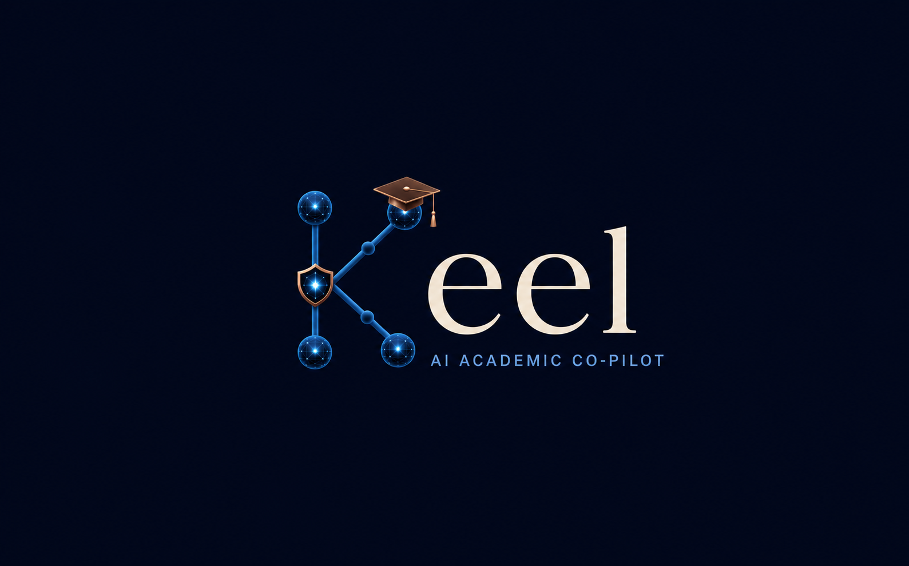
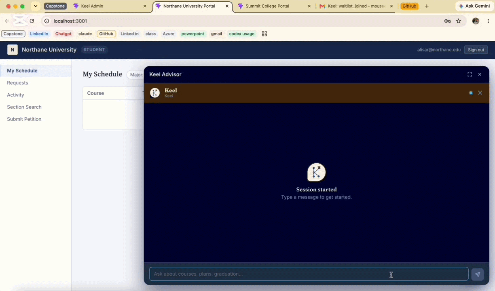
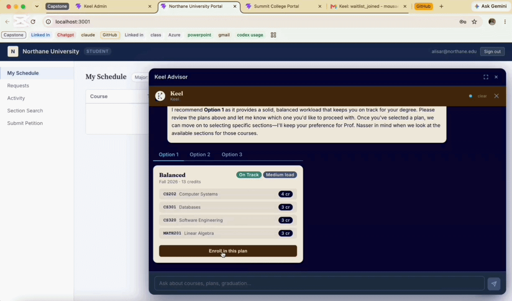
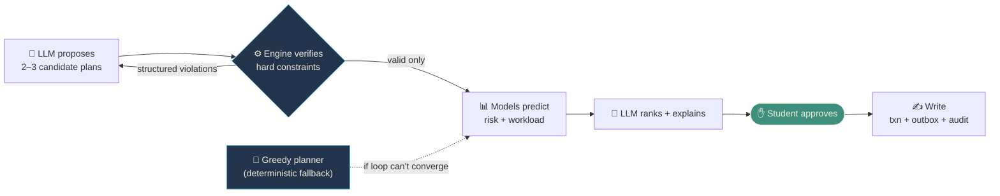
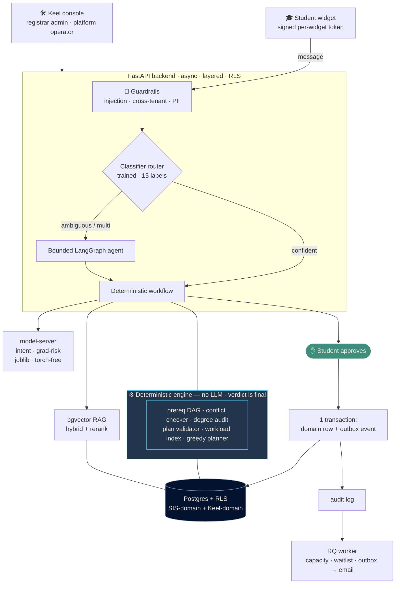

# Keel

[](https://github.com/AlisarAlMusa/Keel/actions/workflows/ci.yml)
[](LICENSE)


**A sanctioned academic co-pilot that plans, predicts, advises — and safely acts.**




Keel is a multi-tenant AI academic advising and registration layer that sits above a
university's Student Information System (Banner, Workday, PeopleSoft). It helps students
plan degree pathways, build valid schedules, assess graduation risk, receive grounded
advising, and safely execute approval-gated academic actions — registration, waitlists,
graduation applications, prerequisite petitions — **only after the student approves**.

**[▶ Watch the full narrated demo](https://youtu.be/dqME1ZT56Vc)** · [Architecture](docs/ARCHITECTURE.md)
· [Design (as-built)](docs/DESIGN.md) · [Quick start](#quick-start)

---

## The problem

Registration and degree planning are painful: hidden time conflicts, prerequisite
surprises, full sections, no advisor at 11 PM, and no straight answer to *"am I on
track to graduate?"* Students fall back on brittle scraping bots; official chatbots
only answer and route to a human; the SIS portal lets you act but can't reason.

Keel is the sanctioned middle ground — an assistant that integrates with the SIS and
can safely act on it, with tenant isolation, human approval before every write, and a
full audit trail. It doesn't just tell a student they're at risk; it builds a legal,
lower-risk plan, registers it on approval, and files the institutional paperwork that
normally requires an office visit.

---

## See Keel in Action

The four clips below are Keel's main product journey — plan, register, recover, and
administer. Each caption gives the one-line takeaway; the linked docs go deeper. The full
narrated video covers everything else (waitlists, guardrails, multilingual advising,
career guidance, institutional requests, and the plumbing).

**[▶ Watch the full narrated demo](https://youtu.be/dqME1ZT56Vc)**

### 1. Constraint-Aware Semester Planning



Course selection — not sections yet. The student asks for a semester plan (e.g. "a
balanced fall load"); the engine builds the eligible pool from the prerequisite DAG and
degree audit, the LLM proposes 2–3 candidate plans, and the engine verifies every one
before it appears — each card already carries a workload chip and a graduation-risk badge.
Section-level choices (times, professors) come next, at registration.

> How it works: [docs/ENGINE.md — the propose→verify→repair loop](docs/ENGINE.md) · [docs/OVERVIEW.md — planning features A1–A2](docs/OVERVIEW.md) · [the planning loop](#core-design-principle)

### 2. Approval-Gated Registration



Now section-level preferences apply — *"no 8 AM, no Fridays, prefer Prof. Nasser."* The
engine returns open, conflict-free sections; the LLM picks a combination; the engine
re-verifies each; and no enrollment is written until the student approves. On approval it
runs through Keel's transactional, idempotent, outbox + audit write path and appears in
the mocked university SIS portal with a "via Keel" badge. The portals shown in the demo
are mock SIS applications built for the demo — they are not Keel applications.

> How it works: [docs/ARCHITECTURE.md — the action pattern](docs/ARCHITECTURE.md) · [docs/OVERVIEW.md — registration B1](docs/OVERVIEW.md) · [Security highlights](#security-highlights)

### 3. Graduation-Risk Prediction and Recovery Planning


A trained graduation-risk model flags a valid plan as on-track or at-risk and names the
drivers; after failed courses, Keel goes further and proposes a recovery path, accounts
for the downstream prerequisite and graduation-date impact, and runs that plan back
through the verifier. Risk output is advisory and trained on documented synthetic
data — never a guarantee.

> How it works: [docs/OVERVIEW.md — recovery C3 & risk model D1](docs/OVERVIEW.md) · [docs/DATA.md — synthetic-data honesty](docs/DATA.md) · [docs/EVALS.md — model gates](docs/EVALS.md)

### 4. Registrar Administration and Platform Operations


Two roles share the Keel console. The **registrar** grounds the agent (catalog/policy
RAG), configures the widget and persona, and reviews audit + cost — all within their own
tenant. The **platform operator** provisions, suspends, and erases tenants without ever
reading tenant content. Suspending a tenant darkens that tenant's Keel widget only; the
university's mocked SIS portal and its data stay outside Keel's authority.

> How it works: [docs/OVERVIEW.md — roles & access](docs/OVERVIEW.md) · [docs/SECURITY.md — the security model](docs/SECURITY.md)

### Also in the demo

The full walkthrough shows more; these clips are one click away, and the capabilities are
documented in [What it does](#what-it-does), [Security highlights](#security-highlights),
and [Architecture](#architecture).

- **[Waitlist & seat-tracking automation](docs/demo/03-waitlist-and-seat-tracking.gif)** — a full section becomes a per-section waitlist; a background worker watches capacity and emails on a seat-open through the outbox ([registration B2](docs/OVERVIEW.md)).
- **[Graduation-risk prediction](docs/demo/04-grad-risk-prediction.gif)** — the standalone "am I on track?" badge from the trained, hash-pinned model, before any recovery step ([risk model D1](docs/OVERVIEW.md)).
- **[Tenant isolation & guardrails](docs/demo/06-isolation-and-guardrails.gif)** — Row-Level Security keeps tenants apart, and injection / cross-tenant / PII rails run on every message, hardcoded ([docs/SECURITY.md](docs/SECURITY.md)).

---

## Core design principle

> *Intelligence proposes. The deterministic engine verifies. Models predict. Execution requires approval.*

This boundary is architectural, not a slogan:

- **LLMs** handle intent, preference and constraint extraction, plan proposals, repairs,
  ranking, and explanation. They have real agency over the *shape* of a plan but can never
  emit an invalid one — the engine catches it first.
- **Deterministic systems** own prerequisites, time conflicts, capacity, credit caps,
  offering terms, coreqs, holds, eligibility, and write validation. Their verdict is final.
- **Trained models** own predictive outputs such as graduation risk — advisory only; they
  never gate feasibility.
- **Side-effecting actions** require explicit approval and follow Keel's transaction,
  idempotency, outbox, and audit patterns.

Three kinds of work live in three layers with hard boundaries:

| Layer | Owns | Can it be wrong? |
|-------|------|------------------|
| **LLM** | intent, constraint extraction, plan proposal, ranking, explanation, drafting | Yes — the engine catches it |
| **Engine** (deterministic, no LLM) | prerequisites, conflicts, capacity, credit caps, offering terms, coreqs, holds, eligibility | No — its verdict is final |
| **Models** | graduation-risk (trained), workload (deterministic) | Advisory only — never gate feasibility |

The planning loop is generate → verify → repair → predict → explain, not a one-shot pass:



A greedy deterministic planner is the fallback. Details: [`docs/ENGINE.md`](docs/ENGINE.md).

---

## What it does

| Capability | Description |
|-----------|-------------|
| **Plan** | Next-semester plans, full graduation paths, what-if simulations, saved/named plans, course swap |
| **Register** | Find open conflict-free sections by preference, enroll after approval, join/leave waitlists, seat-open notifications |
| **Advise** | RAG-grounded course info, degree audit, failure-recovery plans, major-switch reasoning, elective & career guidance |
| **Predict** | Trained graduation-risk model (on-track / at-risk + mitigation), deterministic workload signal, caveated GPA estimate |
| **Act** | Approval-gated enrollment, graduation applications, major-change requests, petitions, advisor escalation |

Full feature catalogue (A1–G2): [`docs/OVERVIEW.md`](docs/OVERVIEW.md).

## Architecture



Two logical domains share one Postgres, isolated by Row-Level Security: the **SIS-domain**
(catalog, sections, students, transcripts, enrollments, requests — seeded) and the
**Keel-domain** (plans, conversations, risk, RAG, config, audit, outbox, cost). In
production the SIS-domain leaves Keel's database behind a `SISGateway` adapter — designed,
not built in the demo. See [`docs/ARCHITECTURE.md`](docs/ARCHITECTURE.md),
[`docs/DESIGN.md`](docs/DESIGN.md) (as-built), and [`docs/PRODUCTION.md`](docs/PRODUCTION.md) (SIS seam).

---

## Tech stack

| Technology | Purpose |
|-----------|---------|
| FastAPI + Pydantic v2 | Async API, typed boundaries, structured LLM/tool I/O |
| PostgreSQL + RLS + Alembic | One DB, two logical domains, tenant isolation at the database |
| pgvector + Cohere | Advising RAG (hybrid dense+sparse, RRF, multilingual rerank), tenant-filtered |
| LangGraph | Bounded tool-calling agent (hard turns only) |
| Gemini (lite + main tiers) | Cheap conversational turns vs. reasoning-heavy flows |
| Redis + RQ | Session/cache + background worker (capacity sync, waitlist, outbox) |
| model-server (joblib + sklearn) | Lean model serving — **no torch, no onnxruntime**; SHA-256-pinned |
| MLflow (Postgres + MinIO) | Experiment tracking + model registry (staging → production) |
| HashiCorp Vault | Secrets at startup (fail-closed) · **MinIO** artifacts |
| OpenTelemetry → Jaeger | End-to-end tracing (request → agent → tool → engine/DB/LLM) |
| React + Vite (npm workspace) | Student widget · Keel console · mock SIS portal · shared `@keel/ui` |
| Docker Compose · GitHub Actions | One-command stack · CI with eval gates |

Every choice is justified in [`docs/OVERVIEW.md`](docs/OVERVIEW.md) §14; non-obvious
choices are logged in [`docs/DECISIONS.md`](docs/DECISIONS.md).

## Evaluation gates

All gates run in CI (`.github/workflows/ci.yml`) and block merge on regression.
Thresholds live in `tests/eval/eval_thresholds.yaml`. Full detail: [`docs/EVALS.md`](docs/EVALS.md).

| Gate | Proves | Where |
|------|--------|-------|
| Planner correctness | No plan violates a hard constraint; every broken plan yields the expected violation | `tests/unit/test_engine_golden.py` |
| Intent classifier | Macro-F1 ≥ 0.75 + covered-accuracy + 100% obvious-case golden | `tests/eval/test_intent_gate.py` |
| Graduation-risk | Macro-F1 ≥ 0.77 + at-risk recall ≥ 0.68 + edge cases | `tests/eval/test_grad_risk_gate.py` |
| Tool selection | Router sends write/read/chitchat intents to the right node | `tests/eval/test_tool_selection.py` |
| Guardrails red-team | 100% of injection + cross-tenant probes refused | `tests/eval/test_redteam_gate.py` |
| PII redaction | Fake keys / emails / IDs never appear unredacted | `tests/eval/test_pii_gate.py` |
| Write-action safety | No injected or unapproved tool call ever reaches a DB write | `tests/unit/test_write_action_safety.py`, `tests/{unit,integration}/test_institutional_write_safety.py` |
| Stack smoke | `docker compose up` → healthy, migrated, RLS policies present, integration tests pass | CI `smoke` job |
| No-torch build guard | `torch` never appears in the model-server lockfile | CI `quality` job (grep) |

Two models are trained offline (Colab), compared three ways, and shipped as
SHA-256-pinned artifacts under `ml/*/artifacts/` with model cards. Provenance and
synthetic-data honesty: [`docs/DATA.md`](docs/DATA.md).

---

## Security highlights

- **Tenant isolation at three independent layers** — Postgres RLS (app connects as a
  `NOBYPASSRLS` role), repository-level scoping, and tenant-filtered pgvector.
- **Every write is approval-gated** — the LLM only *stages* a pending action; the write
  runs only after a student approves via a JWT-authenticated endpoint. No agent tool
  carries an `approved` field, so no injection can self-approve.
- **Guardrails on every message** — injection refusal, cross-tenant refusal, PII
  redaction; hardcoded, not weakenable by tenant config.
- **Secrets from Vault at startup** — the app refuses to boot if Vault is unreachable.

Threat model and guarantees: [`docs/SECURITY.md`](docs/SECURITY.md).

## Quick start

```bash
# 1. Configure (defaults boot locally; no edits needed)
cp .env.example .env

# 2. Bring up the stack (api · worker · model-server · db · redis · minio · vault
#    · mlflow · jaeger · two mock SIS portals)
docker compose up -d --build

# 3. Migrate + seed two tenants (mock catalog, sections, students, transcripts)
docker compose exec api uv run alembic upgrade head
docker compose exec api uv run python -m scripts.seed

# 4. Open
#   Northane portal   http://localhost:3001   (student + registrar)
#   Summit portal     http://localhost:3002   (second tenant — proves isolation)
#   Keel console      http://localhost:8000/keel/   (admin + platform operator)
#   API docs          http://localhost:8000/docs
#   Jaeger traces     http://localhost:16686
```

Demo logins, service URLs, and a cross-tenant walkthrough are in
[`docs/RUNBOOK.md`](docs/RUNBOOK.md); a timed 6-minute script is in
[`docs/DEMO.md`](docs/DEMO.md). The app **fails closed** if Vault is unreachable
(try `docker compose stop vault && docker compose restart api`).

### Local development (no full stack)

```bash
uv sync                                  # backend env (api + worker)
uv run ruff check . && uv run mypy src scripts
uv run pytest tests/unit                 # engine + domain tests (no infra needed)
uv run pytest tests/eval                 # model + guardrail gates (committed artifacts)
cd model-server && uv sync && uv run pytest   # isolated, torch-free service
```

---

## Repository structure

```
keel/
├── src/keel/
│   ├── api/           # FastAPI routers (thin — parse, authorize, delegate)
│   ├── services/      # Use-cases, orchestration, the action pattern, agent host
│   ├── repositories/  # Tenant-scoped DB access (returns domain objects)
│   ├── domain/        # Pure business types + the deterministic ENGINE
│   │   └── engine/    # DAG · audit · verifier · sections · workload · planner
│   ├── infra/         # DB, Redis, Vault, MinIO, guardrails, RAG, LLM, tracing, email
│   ├── workers/       # RQ jobs: capacity sync, waitlist, outbox publisher
│   └── agent/         # LangGraph graph, tools, versioned prompts
├── model-server/      # Separate lean service (joblib + sklearn, torch-free)
├── frontend/          # npm workspace: ui · widget · admin · platform · portal
├── ml/                # Trained artifacts + model cards (intent · grad_risk)
├── data/              # Datasets (intent, grad-risk) + RAG corpus
├── migrations/        # Alembic (0001 … 0015)
├── tests/             # unit (engine) · eval (gates) · integration (through the API)
├── scripts/           # seed, dataset generators, model artifact sync
├── docker-compose.yml
└── docs/              # Documentation set (see below)
```

## Documentation

| Document | Answers |
|----------|---------|
| [`docs/OVERVIEW.md`](docs/OVERVIEW.md) | What is Keel, why, and every feature — the full vision |
| [`docs/ARCHITECTURE.md`](docs/ARCHITECTURE.md) | How the system is organized (intended shape) |
| [`docs/DESIGN.md`](docs/DESIGN.md) | How it's actually built today (as-built design of record) |
| [`docs/PRODUCTION.md`](docs/PRODUCTION.md) | The SIS boundary — demo vs. production |
| [`docs/SECURITY.md`](docs/SECURITY.md) | Threat model, tenant isolation, write-action safety |
| [`docs/SPEC.md`](docs/SPEC.md) | Component contracts (schemas, invariants, edge cases) |
| [`docs/ENGINE.md`](docs/ENGINE.md) | The deterministic engine + plan generation/verification loop |
| [`docs/DATA.md`](docs/DATA.md) | Datasets, provenance, synthetic-data honesty |
| [`docs/EVALS.md`](docs/EVALS.md) | Evaluation strategy, gates, thresholds |
| [`docs/DECISIONS.md`](docs/DECISIONS.md) | Non-obvious technical choices, with rationale |
| [`docs/RUNBOOK.md`](docs/RUNBOOK.md) | Run, troubleshoot, demo credentials, model promotion |
| [`docs/DEMO.md`](docs/DEMO.md) | 6-minute demo script |
| [`docs/STRETCH.md`](docs/STRETCH.md) | Deferred work, with trade-offs and triggers |
| [`CLAUDE.md`](CLAUDE.md) | Build rules and conventions (agent contract, auto-loaded) |

The specification-driven history (per-phase spec/plan/tasks) lives under
[`specs/`](specs/).

## Demo vs. production — honesty notes

Keel is presented as a working demo, and several boundaries are deliberate:

- **The university portals in the demo are mock SIS applications**, built to show Keel
  acting on a realistic system of record. They are not Keel applications.
- **SIS-domain and Keel-domain tables are seeded into the same Postgres database** in the
  demo, and Keel's repositories currently read the seeded SIS-domain tables directly.
- **The production `SISGateway` and per-tenant Banner/Workday/REST adapters are designed
  and documented, not implemented** in the demo.
- **Row-Level Security provides row-based tenant isolation within one shared database** —
  defense-in-depth against cross-tenant access, not physical database separation.
- **Predictions are advisory.** Graduation-risk uses synthetic training data with
  documented generative assumptions and evaluation limits; it is never a guarantee.
- **Institutional and enrollment writes always require explicit approval.**
- **Suspending a Keel tenant disables that tenant's Keel widget only** — it does not
  suspend or control the mocked university SIS or its existing data.

Full boundary detail: [`docs/PRODUCTION.md`](docs/PRODUCTION.md); synthetic-data
provenance: [`docs/DATA.md`](docs/DATA.md); deferred work: [`docs/STRETCH.md`](docs/STRETCH.md).

## License

Released under the [MIT License](LICENSE).
